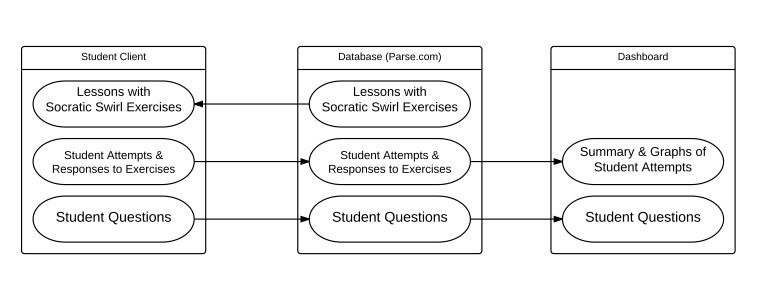

Instructor dashboard for SocraticSwirl
======================================

Socraticswirl, developed on top of swirl, lets instructors of the R programming language offer in-class, interactive programming exercises that the instructors view student answers and progress in real-time. This package lets instructors manage their exercises on the Socratic Swirl application, and launch a dashboard to watch their students' progress.

Socraticswirl had three major components, the student software, a parse.com database, and the instructor software, i.e. the dashboard and course management utilities. Note: as parse.com terminated its service in January 2017, we revised the socraticswirl/socraticswirlInstructo to use the local files system to store data, with the option to use a local batabase in the future.



### Installation and setup

Here are the steps:

    * Install SocraticswirlInstructor
    * Have a student list (such as Records/original_data/studentList.tsv)
    * Have a path to the courses directory (such as Records/data/Courses)
    * Three header files for the merged students exercises data (such as those Records/original_data/)
    * Change the paths within the onLoad function in zzz.R
    * Change the paths in mergeStudentRecords.sh accordingly

##### Install SocraticswirlInstructor

Use the [devtools](https://github.com/hadley/devtools) package to install:

``` r
# devtools::install_github(c("rstudio/shinydashboard", "HJ08003/socraticswirlInstructor-RStudioServer"))
```

The student side software is available at [socraticswirl](https://github.com/HJ08003/socraticswirl-RStudioServer), which maybe be installed on a RStudio server.

Please note that SocraticswirlInstructor may not works with certain version of dplyr. Thus, we specify dplyr version 0.4.3 in the DESCRIPTION file.

##### Set up Shiny servers

Set up and configurate the Shiny servers so that the dashboard applications can access the database at parse.com, and instructors can view the dashboard using browsers. The parse.com keys are needed here. It is important that two Shuny servers are set up, one for test and the other for production.

##### Software Configuration

Configurate the software at both the student side (socraticswirl) and instructor side (socraticswirlInstructor) includes change paths in socraticswirl-RStudioServer and socraticswirlInstructor-RStudioServer. 

##### Edit the student list

A TSV files with 4 fields (email, first, last, and precept) for each students.

##### Specify the courses
    
Need to change the path in zzz.R to point the courses

### Usage

**Please make sure that the configuration files parse_keys.R and server_instance.R under the subdirectory "data" is updated accordingly**.

The dashboard application runs in the directory where server.R and ui.R are. 

To use the dashboard, you may do the following:
    * load packages socraticswirlInstructor and shiny
    * change working directory to where server.R and ui.R are

If you are using RStudio, this will start the dashboard application on your computer to show your students' progress and answering activity in real time:
``` r
library(socraticswirlInstructor)
library(shiny)
setwd(paste0(getwd(), "/inst/dashboard"))  # change to the directory where server.R and ui.R are 
runApp()
```

If you plan to running R at the command line, please change working directory to where server.R and ui.R are. In the socraticswirlInstructor package, it is the subdirectory inst/dashboard. Once you start the R session, you may do the following
``` r
library(socraticswirlInstructor)
library(shiny)
runApp()
```

You may launch the dashboard on the Shiny server. Once the Shiny server (for example s.univ.edu) runs, instructors and preceptors can access your Socraticswirl dashboard at the following web address:

    http://s.univ.edu/

### Creating Exercises

Exercises are created in SocraticSwirl the same way they are created for Swirl. [Here](http://swirlstats.com/instructors.html) you can read in detail about creating interactive exercises using the "swirlify" tool. In short, quiz questions are structured as [YAML](http://en.wikipedia.org/wiki/YAML) files, in a form something like this:

    - Class: cmd_question
      Output: Now store the contents of the 'cars$mpgCity' in a new variable called 'myMPG'.
      CorrectAnswer: myMPG <- cars$mpgCity
      AnswerTests: newcmd=myMPG <- cars$mpgCity
      Hint: Use the assignment operator to assign 'cars$mpgCity' to a new variable called
        'myMPG'.

Alternatively you could write a multiple choice question:

    - Class: mult_question
      Output: Mean, median, and mode are all measures of ____________.
      AnswerChoices: variation; significance; deviation; central tendency
      CorrectAnswer: central tendency
      AnswerTests: word=central tendency
      Hint: This is a fancy term for the "middle" of a dataset.

**Note**: in regular Swirl, questions are usually interspersed with text paragraphs and demonstrations. This is probably not the right approach for a set of SocraticSwirl exercises, since your students will be taking them in your class. Instead, make each of your items a question (either multiple choice or command-based).

### Available swirl courses

There are swirl courses and/or lessons available at https://github.com/kosukeimai/qss-swirl. To get the course from the GitHub:

    git clone https://github.com/kosukeimai/qss

These courses are compatible for both swirl and socraticswirl. For people who are interested in making course compatible, CAUSALTY2 may be a good example where the data is stored accordingly by initLesson.R:

``` r
# Code placed in this file fill be executed every time the
# lesson is started. Any variables created here will show up in
# the user's working directory and thus be accessible to them
# throughout the lesson.


# Make path to lesson directory
lesson_dir <- file.path(path.package(substring(find("swirl")[1], 9)), "Courses",
                        "qss-swirl", "CAUSALITY2")

# Make path to data and let user call read.csv(data_path)
data_path <- file.path(lesson_dir, "resume.csv")
data_path2 <- file.path(lesson_dir, "social.csv")

# Load data into a variable for the user
resume <- read.csv(data_path, stringsAsFactors=FALSE)
social <- read.csv(data_path2, stringsAsFactors=FALSE)
```
